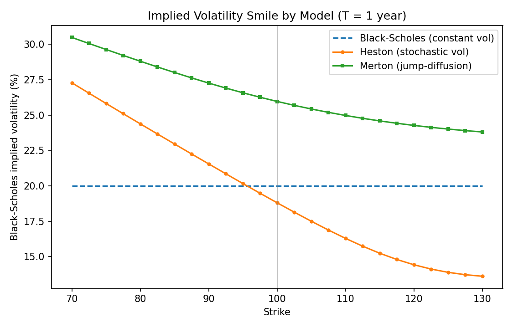
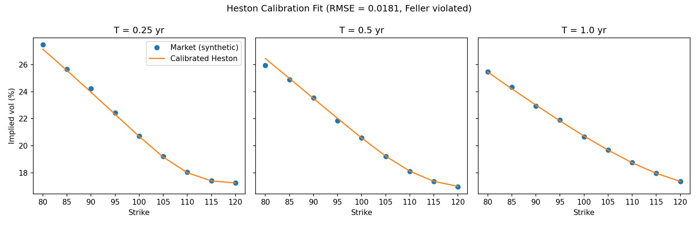

# Options Pricing Engine

A from-scratch derivatives-pricing library spanning the classical Black-Scholes
benchmark through stochastic-volatility, jump-diffusion, exotic, and American
options. The organising theme is **cross-validation**: every method is checked
against an independent one (Fourier vs. Monte Carlo, lattice vs. closed form,
simulation vs. analytic control variate).

A companion academic paper, [**"Beyond Black-Scholes"**](paper/paper.pdf)
([LaTeX source](paper/paper.tex)), writes up the models, methods, and numerical
results.

## What's implemented

**Models**
- **Black-Scholes-Merton** — closed-form price and analytic Greeks (Δ, Γ, vega, Θ, ρ)
- **Heston (1993) stochastic volatility** — semi-analytic Fourier pricing (Albrecher
  "good" characteristic function) *and* full-truncation Euler Monte Carlo
- **Merton (1976) jump-diffusion** — closed-form Poisson series *and* Monte Carlo

**Numerical methods**
- **Cox-Ross-Rubinstein binomial tree** — European and American exercise
- **Monte Carlo** — antithetic variates + control variates
- **Quasi-Monte Carlo** — scrambled Sobol sequence, ~`O(n⁻¹)` convergence
- **Longstaff-Schwartz** least-squares Monte Carlo for American options

**Exotics (path-dependent, Monte Carlo)**
- Arithmetic **Asian** options with a geometric-Asian control variate (~36× variance reduction)
- **Barrier** options (knock-in/out), validated by in-out parity
- Floating-strike **lookback** options

**Applications**
- **Implied volatility** solver (Newton-Raphson with Brent fallback)
- **Volatility smile / surface** construction
- **Heston calibration** to a market volatility surface (least squares)

## Key results

Every method agrees with an independent benchmark:

| Contract | Method A | Method B |
|---|---|---|
| European ATM call | Black-Scholes 10.4506 | QMC 10.4505 / Tree 10.4466 / MC 10.4661±0.013 |
| Heston call | Fourier 10.155 | Monte Carlo 10.198±0.025 |
| Merton call | Series 11.662 | Monte Carlo 11.678±0.017 |
| American put | Lattice 6.090 | Longstaff-Schwartz 6.082±0.023 |
| Barrier (in+out) | Monte Carlo 10.440 | Vanilla 10.451 |

**The volatility smile** — the central qualitative result. Black-Scholes is flat
by construction; Heston (ρ = −0.7) produces a skew and Merton's jumps produce a
smile, matching what's observed in real markets:



**Quasi-Monte Carlo** improves the convergence rate from `O(n⁻¹/²)` to ~`O(n⁻¹)`:


**Heston calibration** recovers the generating parameters from a synthetic
surface to under two volatility basis points RMSE:



(See `results/` for the binomial convergence, MC variance reduction, and Heston
surface plots as well.)

## Project structure

```
options_pricing/
  black_scholes.py     # closed-form price + Greeks
  binomial_tree.py      # CRR tree, European & American
  monte_carlo.py         # GBM MC, antithetic + control variate
  quasi_mc.py             # Sobol quasi-Monte Carlo
  implied_vol.py           # Newton-Raphson + Brent fallback
  heston.py                 # Heston: Fourier pricing + MC
  merton_jump.py             # Merton jump-diffusion: series + MC
  paths.py                    # GBM path simulation, Sobol normals
  exotics.py                   # Asian, barrier, lookback
  american_mc.py                # Longstaff-Schwartz LSM
  vol_surface.py                 # implied-vol smile/surface
  calibration.py                  # Heston calibration
tests/                              # 31 cross-validation tests
demo/
  run_demo.py            # benchmark: convergence + variance-reduction plots
  advanced_demo.py        # smile, surface, QMC, calibration plots
paper/
  paper.tex               # academic write-up (LaTeX source)
  paper.pdf                # compiled paper
results/                    # generated figures
```

## Setup

```bash
pip install -r requirements.txt
```

## Usage

```python
from options_pricing import (
    bs_price, heston_price, merton_price,
    asian_mc_price, longstaff_schwartz_price, calibrate_heston,
)

# Black-Scholes
bs = bs_price(S=100, K=100, T=1, r=0.05, sigma=0.2, option_type="call")

# Heston stochastic volatility (semi-analytic Fourier price)
hest = heston_price(S0=100, K=100, T=1, r=0.05,
                    v0=0.04, kappa=2.0, theta=0.04, sigma=0.5, rho=-0.7,
                    option_type="call")

# Merton jump-diffusion (closed-form series)
mert = merton_price(S=100, K=100, T=1, r=0.05, sigma=0.2,
                    lam=0.5, muJ=-0.1, sigmaJ=0.15, option_type="call")

# Arithmetic Asian with geometric control variate
asian, se = asian_mc_price(S0=100, K=100, T=1, r=0.05, sigma=0.2, n_fixings=50)

# American put via Longstaff-Schwartz
am_put, se = longstaff_schwartz_price(S0=100, K=100, T=1, r=0.05, sigma=0.2,
                                      option_type="put")
```

## Tests

```bash
pytest -v
```

31 tests covering put-call parity, lattice/Fourier/series/MC cross-agreement,
variance-reduction efficiency, QMC convergence, in-out barrier parity, and
round-trip Heston calibration.

## Reproducing the figures

```bash
python demo/run_demo.py        # benchmark figures
python demo/advanced_demo.py    # smile, surface, QMC, calibration
```

## Building the paper

The compiled [`paper/paper.pdf`](paper/paper.pdf) is included. To rebuild from
source you need a LaTeX distribution (e.g. TeX Live or MiKTeX):

```bash
cd paper && pdflatex paper.tex && pdflatex paper.tex
```
