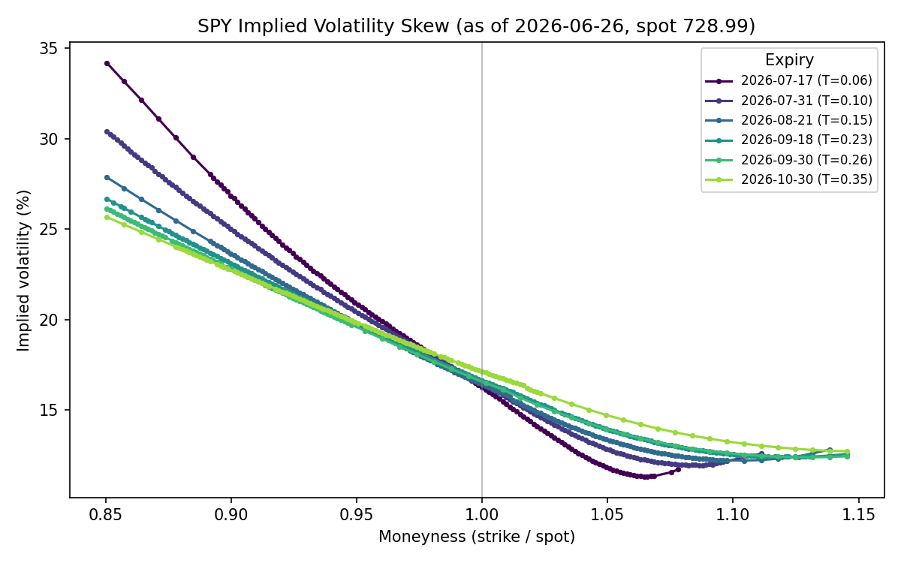
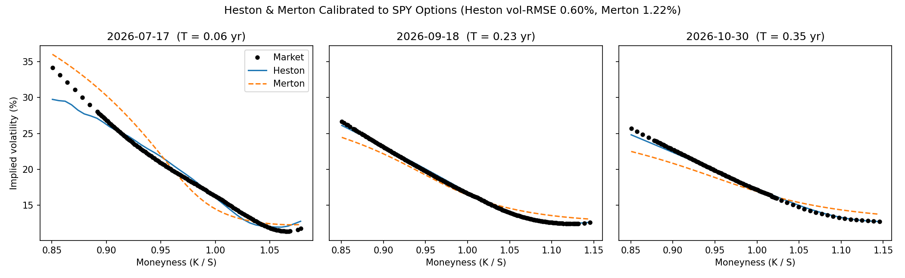
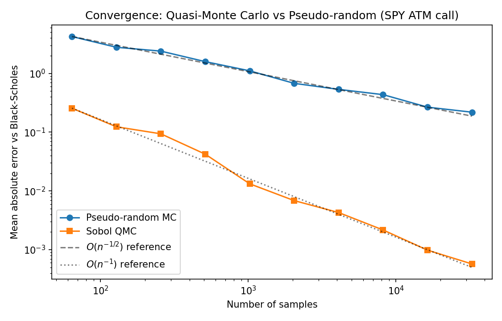

# Options Pricing Engine

A from-scratch derivatives-pricing library spanning the classical Black-Scholes
benchmark through stochastic-volatility, jump-diffusion, exotic, and American
options — **calibrated to and validated on real S&P 500 (SPY) option market
data**. The organising theme is **cross-validation**: every method is checked
against an independent one (Fourier vs. Monte Carlo, lattice vs. closed form,
simulation vs. analytic control variate).

A companion academic paper, [**"Beyond Black-Scholes"**](paper/paper.pdf)
([LaTeX source](paper/paper.tex)), writes up the models, methods, and the
empirical calibration to SPY options.

## What's implemented

**Models**
- **Black-Scholes-Merton** — closed-form price and analytic Greeks (Δ, Γ, vega, Θ, ρ)
- **Heston (1993) stochastic volatility** — semi-analytic Fourier pricing (Albrecher
  "good" characteristic function) *and* full-truncation Euler Monte Carlo
- **Merton (1976) jump-diffusion** — closed-form Poisson series *and* Monte Carlo

**Numerical methods**
- **Cox-Ross-Rubinstein binomial tree** — European and American exercise
- **Monte Carlo** — antithetic variates + control variates
- **Quasi-Monte Carlo** — scrambled Sobol sequence, ~`O(n⁻¹)` convergence
- **Longstaff-Schwartz** least-squares Monte Carlo for American options

**Exotics (path-dependent, Monte Carlo)**
- Arithmetic **Asian** options with a geometric-Asian control variate (~36× variance reduction)
- **Barrier** options (knock-in/out), validated by in-out parity
- Floating-strike **lookback** options

**Real market data & calibration**
- `data/fetch_data.py` pulls a live SPY option chain from Yahoo Finance, implies
  the forward per expiry from put-call parity, and writes a clean snapshot
- **Implied volatility** solver (Newton-Raphson with Brent fallback)
- **Volatility smile / surface** construction from real quotes
- **Heston *and* Merton calibration** to the real SPY surface (vega-weighted least squares)

## Key results (real SPY options, as of 2026-06-26, spot $728.99)

Calibrated to **903 liquid quotes across 6 maturities**, both models reproduce the
market skew that Black-Scholes cannot:

| Model | Calibrated highlights | Vol RMSE |
|---|---|---|
| Heston | ρ = −0.71 (leverage skew), ξ = 1.48 | **0.60%** |
| Merton | λ = 0.85/yr, μ_J = −0.13 (crash jumps) | **1.22%** |

Cross-validation on the real ATM SPY contract (S=729, T=0.23, ATM IV=16.7%) — every method agrees with an independent one:

| Contract | Method A | Method B |
|---|---|---|
| European call | Black-Scholes 28.334 | QMC 28.333 / Tree 28.322 / MC 28.338±0.038 |
| Heston call | Fourier 28.545 | Monte Carlo 28.732±0.067 |
| Merton call | Series 27.990 | Monte Carlo 27.996±0.045 |
| American put | Lattice 19.500 | Longstaff-Schwartz 19.505±0.077 |

**The real SPY volatility skew** — the central empirical fact, one curve per expiry:



**Heston & Merton calibrated to the real skew** (Heston vol-RMSE 0.60%):



**Quasi-Monte Carlo** improves the convergence rate from `O(n⁻¹/²)` to ~`O(n⁻¹)`:



(See `results/` for the calibrated-Heston surface, return distributions, Greeks
profiles, American exercise boundary, smile-sensitivity, and convergence plots.)

## Project structure

```
options_pricing/
  black_scholes.py     # closed-form price + Greeks
  binomial_tree.py      # CRR tree (Euro/American) + exercise boundary
  monte_carlo.py         # GBM MC, antithetic + control variate
  quasi_mc.py             # Sobol quasi-Monte Carlo
  implied_vol.py           # Newton-Raphson + Brent fallback
  heston.py                 # Heston: Fourier pricing + MC
  merton_jump.py             # Merton jump-diffusion: series + MC
  paths.py                    # GBM path simulation, Sobol normals
  exotics.py                   # Asian, barrier, lookback
  american_mc.py                # Longstaff-Schwartz LSM
  vol_surface.py                 # implied-vol smile/surface
  calibration.py                  # Heston & Merton calibration
data/
  fetch_data.py          # pull a live SPY chain from Yahoo Finance
  options.csv             # committed real-data snapshot
  meta.json                # snapshot metadata (spot, rate, forwards)
tests/                       # 36 cross-validation tests
demo/
  real_data_demo.py      # load data, calibrate, real-data figures + summary
  run_demo.py             # benchmark convergence/variance-reduction (real contract)
  advanced_demo.py         # surface, distributions, Greeks, boundary, sensitivity
paper/
  paper.tex               # academic write-up (LaTeX source)
  paper.pdf                # compiled paper
results/                    # generated figures + real_summary.json
```

## Setup

```bash
pip install -r requirements.txt
```

## Usage

```python
from options_pricing import (
    bs_price, heston_price, merton_price,
    asian_mc_price, longstaff_schwartz_price, calibrate_heston, calibrate_merton,
)

# Black-Scholes
bs = bs_price(S=100, K=100, T=1, r=0.05, sigma=0.2, option_type="call")

# Heston stochastic volatility (semi-analytic Fourier price)
hest = heston_price(S0=100, K=100, T=1, r=0.05,
                    v0=0.04, kappa=2.0, theta=0.04, sigma=0.5, rho=-0.7,
                    option_type="call")

# Calibrate Heston to market quotes: (K, T, price, type) or (K, T, price, type, r, q)
result = calibrate_heston(quotes, S0=728.99)   # -> {v0, kappa, theta, sigma, rho, rmse, ...}
```

## Reproducing the real-data study

```bash
python data/fetch_data.py        # refresh the SPY snapshot (optional; one is committed)
python demo/real_data_demo.py     # calibrate + market_smile / calibration_fit figures
python demo/run_demo.py            # benchmark convergence figures (real contract)
python demo/advanced_demo.py        # surface, distributions, Greeks, boundary, sensitivity
```

`real_data_demo.py` writes `results/real_summary.json`, which the other two demos
read so every figure is based on the same real, calibrated parameters.

## Tests

```bash
pytest -v
```

36 tests covering put-call parity, lattice/Fourier/series/MC cross-agreement,
variance-reduction efficiency, QMC convergence, in-out barrier parity, terminal
martingale checks, the American exercise boundary, and Heston/Merton calibration.
(Tests use deterministic synthetic data — no network required.)

## Building the paper

The compiled [`paper/paper.pdf`](paper/paper.pdf) is included. To rebuild from
source you need a LaTeX distribution (e.g. TeX Live or MiKTeX):

```bash
cd paper && pdflatex paper.tex && pdflatex paper.tex
```
