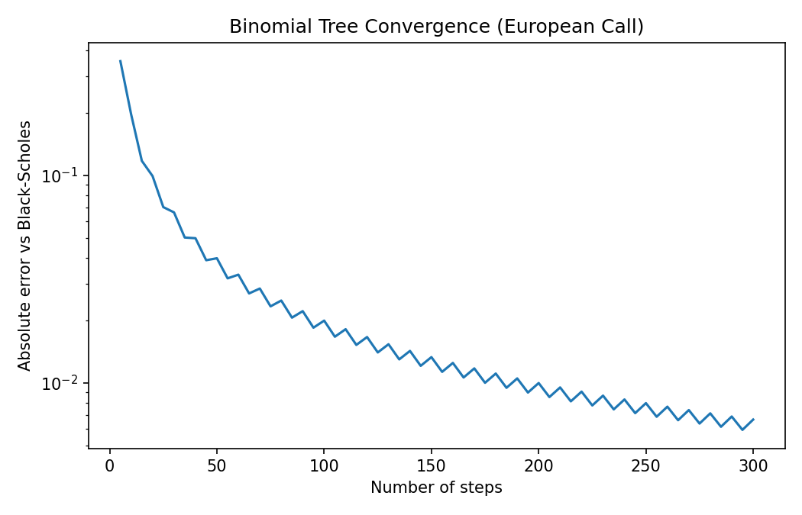
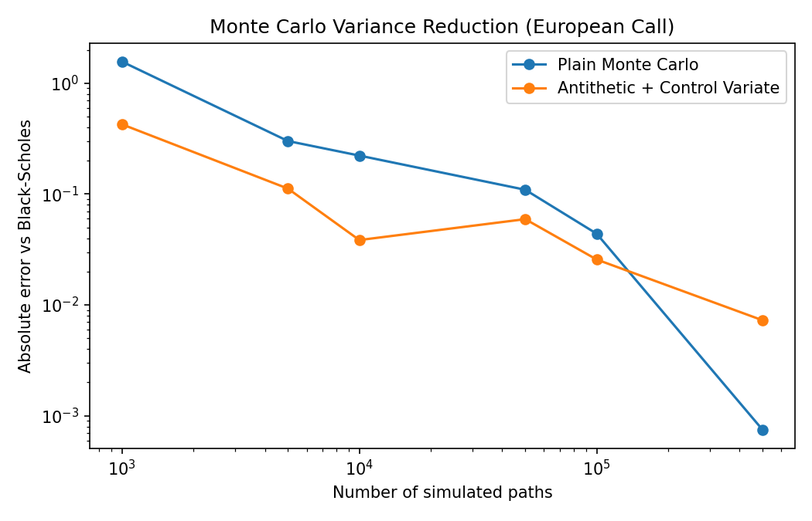

# Options Pricing Engine

A from-scratch implementation of three standard approaches to European/American
option pricing, built to compare their accuracy, convergence, and computational
trade-offs:

- **Black-Scholes-Merton** closed-form price and Greeks (delta, gamma, vega, theta, rho)
- **Cox-Ross-Rubinstein binomial tree**, supporting both European and American exercise
- **Monte Carlo simulation** under geometric Brownian motion, with antithetic
  variates and a control-variate estimator for variance reduction
- **Implied volatility solver** (Newton-Raphson with a Brent's-method fallback
  for low-vega regions)

## Why these three methods

Each method makes a different trade-off:

| Method | Exercise style | Speed | Notes |
|---|---|---|---|
| Black-Scholes | European only | Instant (closed-form) | Ground truth for European options |
| Binomial tree | European & American | Fast, scales with steps² | Only practical way here to price American options |
| Monte Carlo | European (path-dependent payoffs extend naturally) | Slower, scales with paths | Necessary for path-dependent/exotic payoffs that lack closed forms |

## Results

Pricing a 1-year ATM call (S=K=100, r=5%, σ=20%):

| Method | Price |
|---|---|
| Black-Scholes | 10.4506 |
| Binomial tree (500 steps) | 10.4466 |
| Monte Carlo (200k paths) | 10.4661 ± 0.0126 (1 std. error) |

**Binomial tree convergence** — absolute error vs. Black-Scholes as the number
of tree steps increases:



**Monte Carlo variance reduction** — plain simulation vs. antithetic variates +
control variate, at matched path counts:



Variance reduction consistently cuts the error by roughly an order of
magnitude at a given path count, which matters a lot in practice since Monte
Carlo error only shrinks as 1/√n — getting another digit of accuracy by
brute force alone requires 100x more paths.

## Project structure

```
options_pricing/
  black_scholes.py   # closed-form price + Greeks
  binomial_tree.py    # CRR tree, European & American
  monte_carlo.py       # GBM simulation, antithetic + control variate
  implied_vol.py       # Newton-Raphson with Brent fallback
tests/                  # correctness tests (put-call parity, convergence, etc.)
demo/run_demo.py         # generates the plots and summary table above
results/                  # output plots
```

## Setup

```bash
pip install -r requirements.txt
```

## Usage

```python
from options_pricing import bs_price, bs_greeks, binomial_price, mc_price, implied_vol

# Black-Scholes price and Greeks
price = bs_price(S=100, K=100, T=1, r=0.05, sigma=0.2, option_type="call")
greeks = bs_greeks(S=100, K=100, T=1, r=0.05, sigma=0.2, option_type="call")

# American put via binomial tree
am_put = binomial_price(S=100, K=100, T=1, r=0.05, sigma=0.2,
                         n_steps=500, option_type="put", american=True)

# Monte Carlo with variance reduction
mc_call, std_error = mc_price(S=100, K=100, T=1, r=0.05, sigma=0.2,
                               option_type="call", n_paths=200_000)

# Solve for implied vol given a market price
iv = implied_vol(price=10.45, S=100, K=100, T=1, r=0.05, option_type="call")
```

## Tests

```bash
pytest -v
```

13 tests cover put-call parity, convergence of the binomial tree to
Black-Scholes, Monte Carlo accuracy within its confidence interval, American
vs. European exercise value, and round-trip recovery of implied volatility.

## Reproducing the plots

```bash
python demo/run_demo.py
```
